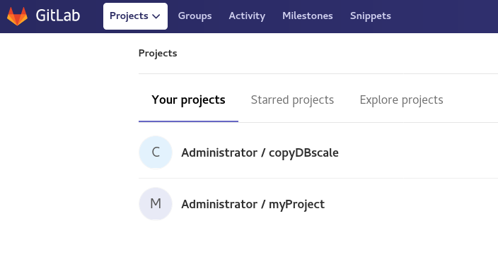
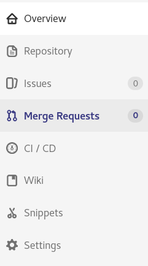
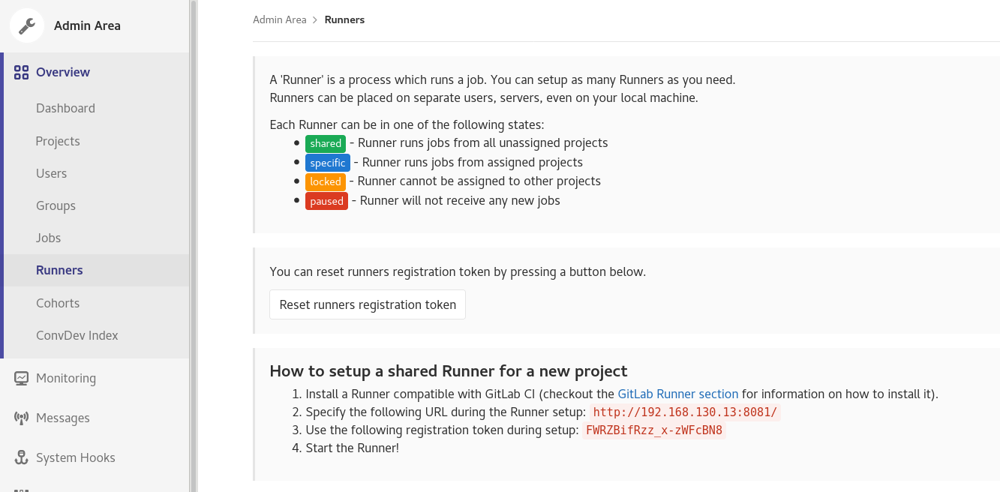
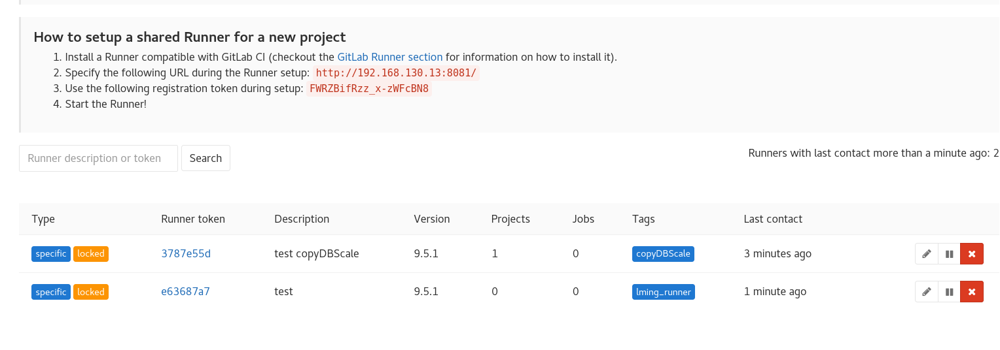
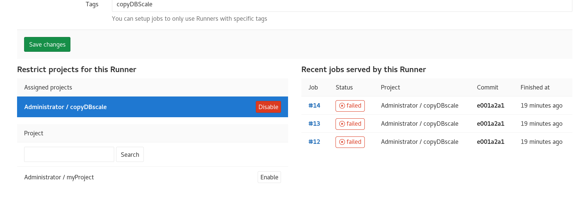

# gitlab环境下的CI/CD 持续集成部署测试

当前我们讨论的，是以gitlab为版本管理平台，并通过gitlab-runner进行持续集成测试的办法。假设当前已经搭建并可以正常使用gitlab系统。



在gitlab中使用CI的基本过程分为以下步骤：

- [x] 创建了项目
- [x] 安装了gitlab-runner插件
- [x] 生成了测试用的shell脚本或docker镜像
- [x] 创建用于执行测试任务的runner
- [x] 编写当前项目的yml脚本文件
- [x] 创建针对版本的执行计划
- [x] 等待runner根据时间计划自动执行
- [x] 查看执行结果并加以分析

## 1.创建项目

和普通的使用一样，但是如果gitlab还没有安装gitlab-runner插件的话，左侧列表菜单的CI/CD下，不会有pipelines、jobs、schedules等内容。




## 2.安装gitlab-runner插件

以centos为例：

```
# 添加yum源
curl -L https://packages.gitlab.com/install/repositories/runner/gitlab-ci-multi-runner/script.rpm.sh | sudo bash
# 安装
yum install gitlab-runner
# 查看版本
gitlab-runner -v
```

gitlab的管理员登录gitlab后台，找到runner的页面，这个也页面上有注册runner的两个信息:

Specify the following URL during the Runner setup

Use the following registration token during setup



开始配置一个具体的runner，在命令行中执行：

```
[root@localhost ~]#  gitlab-runner register
Running in system-mode.  
Please enter the gitlab-ci coordinator URL (e.g. https://gitlab.com/):
--这里输入管理页面显示的地址信息

Please enter the gitlab-ci token for this runner:
--这里输入管理页面的那个token值

Please enter the gitlab-ci description for this runner:
[localhost.localdomain]: --根据情况输入

Please enter the gitlab-ci tags for this runner (comma separated):
--输入这个runner的tags，这个比较重要，之后的yml文件中的tags，就是这个，也是用来区分不同runner的主要参数。

# 是否运行未标记的版本
Whether to run untagged builds [true/false]:
[false]: false --false的话，runner只运行标记的版本，会多一个specific的标签

# 是否将运行程序锁定到当前项目
Whether to lock Runner to current project [true/false]:
[false]: true --会多一个locked的标签

Registering runner... succeeded                     runner=xrjc3tWc
#  引导会让你输入executor，这个是要用什么方式来执行脚本，根据运行环境选择，例如使用docker的镜像环境，则可以选择docker，如果全部在本地的环境中执行，也可以选择shell
Please enter the executor: shell, ssh, docker+machine, docker, docker-ssh, parallels, virtualbox, docker-ssh+machine, kubernetes:
shell

Runner registered successfully. Feel free to start it, but if it's running already the config should be automatically reloaded! 
--完成新runner的注册。
```

重新登录gitlab的管理页，查看runner页面，会发现增加了runner的记录。



接下来，就可以在环境中使用runner了。

## 3.生成了测试用的shell脚本或docker镜像

由于使用gitlab做集成测试或部署，所以一般选择的触发条件就是定时执行，或当有代码提交时执行，而运行环境就是在这台gitlab服务器上，有时候由于项目本身的原因，部署会比较麻烦，因此我们可能会提前准备docker镜像作为测试环境，运行时由gitlab的目录和docker的容器内容做交互。同理，单纯使用shell的话，所有的操作都要放在yml的script步骤中完成。

注意如果在注册新runner的时候，executor选择了docker，会让你输入要使用的docker镜像，而在执行过程中，操作就会在这个镜像的容器里里完成。

## 4.创建用于执行测试任务的runner

其实具体的注册和创建工作已经在上面的步骤完成了，正式启用某个runner，需要在管理页的runner页面，进入该runner的编辑页面，点击enable，使他开始工作。



## 关于执行中的安排，一个分支里只有一个yml脚本，因此对于一个版本中如果要执行多个测试的任务，就需要把不同的测试执行顺序写在一个yml中，用stages等信息做区分。如果有并行任务，就需要增加版本分支进行测试。

同时一个项目里可以有多个运行的runner，但具体这个runner是否执行动作，要看yml文件中的tags是否定义了他。

由于yml文件中的任务是顺序进行的，所以runner的执行是不会冲突的。

## 5.编写当前项目的yml脚本文件

```
stages:
  - test
########################################
######### centos 7 start ###############
########################################
build_centos7_debug:
  stage: test
  retry: 2
  tags:
    - copyDBScale
  script:
    - cd /tmp
    - touch lming
    - echo '123456' > tmp
    - cat tmp
######## centos 7 end #################
```

当前使用的是docker镜像，用copyDBScale这个runner执行。

## 6.创建针对版本的执行计划

在CI/CD的schedules中进行

## 7.等待runner根据时间计划自动执行

等待系统时间达到预期执行时间

## 8.查看执行结果并加以分析

查看实际运行结果